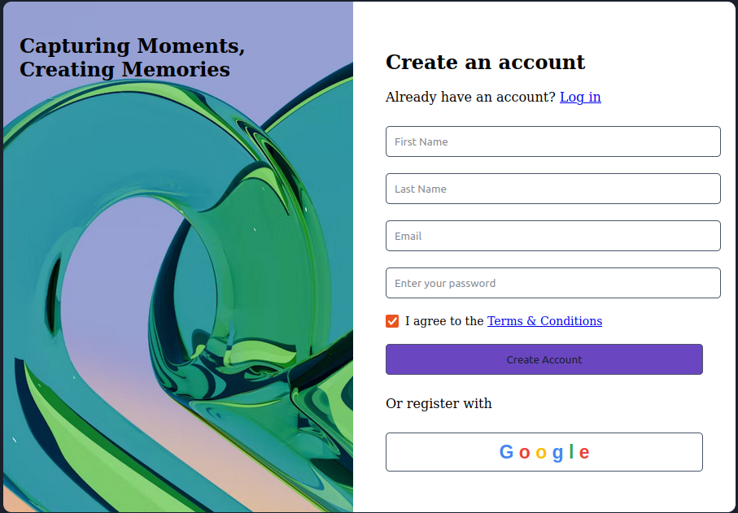

## SignupForm Web Component


This folder contains a SignupForm web component implemented using Vanilla JavaScript, HTML, and CSS. It provides a responsive sign-up form with a left-side banner and a right-side form section.

## Features

- Encapsulated Web Component using Shadow DOM

- Google-style text button without SVG

- Fully responsive for different screen sizes

- Customizable styles with CSS variables

## Installation & Usage

To use this component in your project, include it in your HTML file:

### HTML

```bash
   <signup-form></signup-form>
``` 
### JavaScript Explanation

- This component extends the HTMLElement class, making it a custom HTML element. The constructor method is executed when an instance is created. Here's a breakdown of the logic:

- Shadow DOM Creation: The attachShadow({ mode: "open" }) ensures styles and scripts within the component do not interfere with the rest of the page.

- Container Setup: A <div> is created and structured into two sections:

- Left Section: Displays an image and a tagline.

- Right Section: Contains the signup form, input fields, a terms agreement checkbox, and a Google-style text button.

- Form Elements: The form includes fields for first name, last name, email, password, and a checkbox for agreeing to terms.

- Custom Google Button: The Google sign-up button is built using styled <span> elements instead of an SVG for a more flexible design.

- Styling with Shadow DOM: A <style> element is added dynamically, containing CSS that makes the form responsive and visually appealing.

## License

This project is free to use and modify for personal or commercial use.